# Overview

### A mid-sized technology company called Compliant Secure, with 50 employees, has recently migrated to Microsoft 365. During a routine security review, the SOC team discovered suspicious authentication patterns.

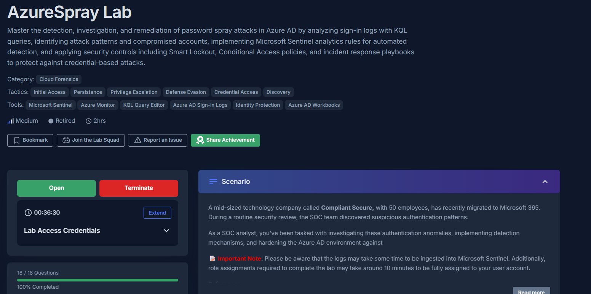

 

### Methodology:

**Our task is to investigate these authentication anomalies, implement detection mechanisms, and harden the Azure AD environment.**

---

 

### Attack Chain:

                                       Reconnaissance of valid Microsoft 365 user accounts
                                                               ↓
                                       Password spray attack launched against 89 user accounts
                                            (ResultType 50126 - Invalid credentials)
                                                               ↓
                                   Authentication attempts distributed across multiple AWS IPs
                                          (3.123.14.162, 3.123.14.126, 3.70.195.178)
                                                               ↓
                                   Azure AD Smart Lockout triggered on targeted victim accounts
                                                 (ResultType 50053 observed)
                                                               ↓
                                  One account successfully authenticated after password spraying
                                      (louisa.hartis@compliantsecure.store compromised)
                                                               ↓
                                Successful Microsoft Entra ID / Azure AD authentication (ResultType 0)
                                                               ↓
                                   Attacker gains authenticated access to Microsoft 365 tenant
                                                               ↓
                              Opportunity for privilege enumeration, persistence, and lateral movement
---

 

## Indicators of Compromise:

---

 

## MITRE ATT&CK Mapping:

---

 

# Investigation:

## 1. Initial Attack Detection

### 1.1) During the initial investigation, you notice a pattern of failed authentication attempts. What is the most common Result Type associated with password spray attacks in Azure AD sign-in logs?

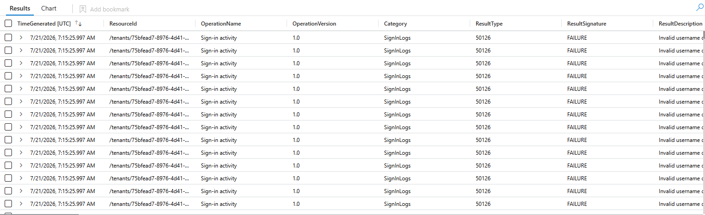

Outputting the whole table, we see the "ResultType" column, so we can query for the number of distinct result types:

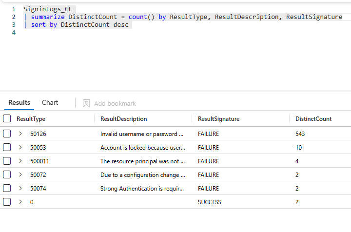

We see the most frequent result type is 50126 by far
**Answer: 50126**

 

### 1.2) Analyzing the sign-in logs, you identify multiple source IP addresses attempting authentication. Which IP address had the highest number of failed login attempts during the attack window?

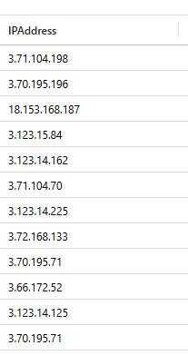

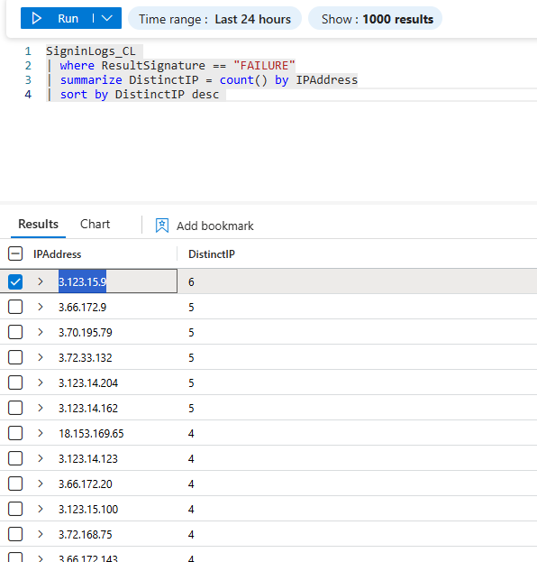

**Answer: 3.123.15.9**

 

### 1.3) The attacker appears to be using a specific user agent string across all spray attempts. What is the user agent string identified in the attack?

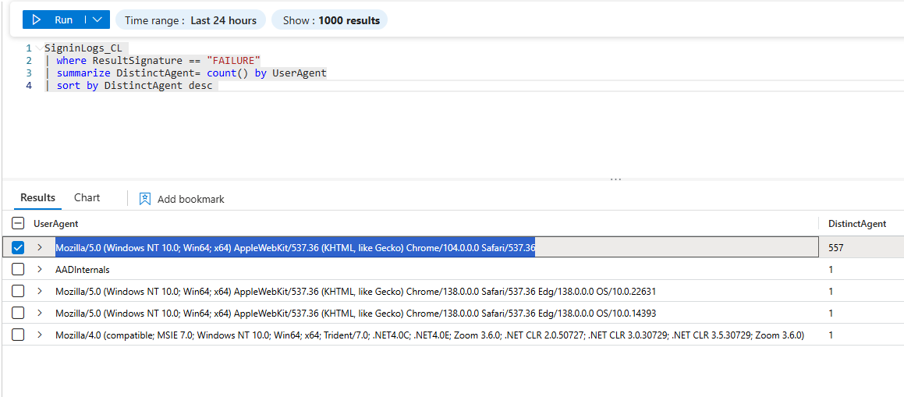

**Answer: Mozilla/5.0 (Windows NT 10.0; Win64; x64) AppleWebKit/537.36 (KHTML, like Gecko) Chrome/104.0.0.0 Safari/537.36**

 

### 1.4) Smart Lockout events are crucial for identifying password spray victims. What is the specific sign-in error code that indicates an account has been locked out by Azure AD Smart Lockout?

reference 1.1

**Answer: 50126**

 

### 1.5) What time (UTC) in CreatedDateTime did the password spray attack begin based on the first failed authentication attempt?

**Answer: 2025-06-29 18:35**

---

 

## 2. Attack Pattern Analysis

### 2.1) How many unique user accounts in the Compliant Secure company were targeted in this password spray attack?

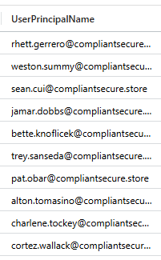

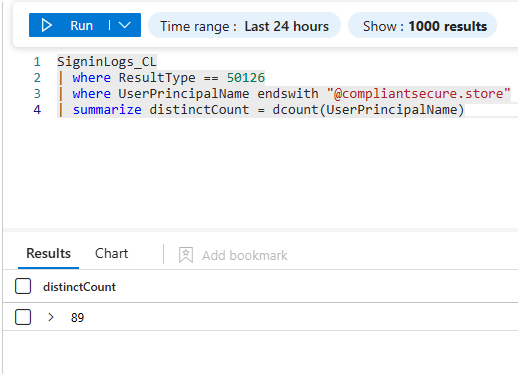

**Answer: 89**

 

### 2.2) The attack originated from a single country. What is the name of the region where the attack originated?

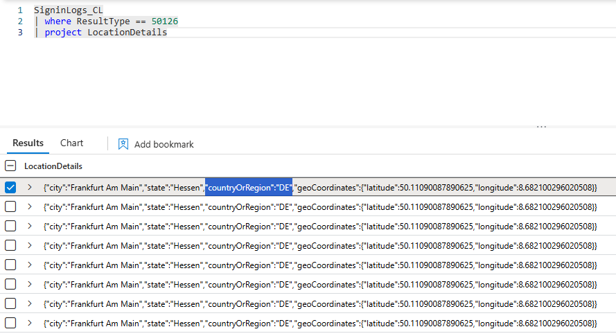

**Answer: DE**

---

 

## 3. Detection and Response

### 3.1) Detection in Microsoft Sentinel relies on analytics rules that continuously monitor logs for suspicious patterns. To investigate this attack: In Microsoft Sentinel, navigate to Content Hub and install the Microsoft Entra ID solution. Once installed, go to Analytics > Rule templates and you'll see several analytics rules related to password spray attacks. What is the name of the analytics rule that identifies evidence of failures from multiple accounts against Microsoft Entra ID applications?

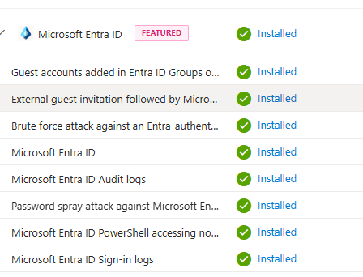

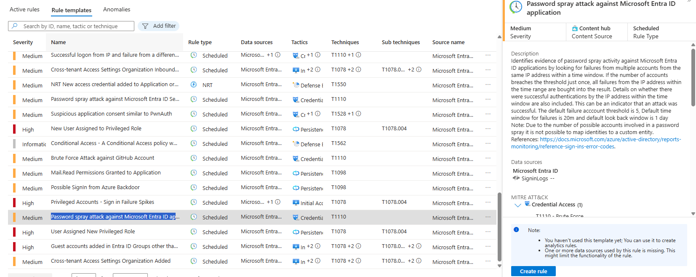

**Answer: Password spray attack against Microsoft Entra ID application**

 

### 3.2) Create an analytics rule based on the template from the previous question, but modify it to use the "SigninLogs_CL" custom table and update all column references to match the custom table schema. In the rule configuration, there's a parameter called authenticationThreshold that defines how many failed account attempts from a single IP address trigger an alert. Based on the attack patterns observed in this incident, what is the maximum value you should set for authenticationThreshold to ensure the rule would have detected this specific attack?

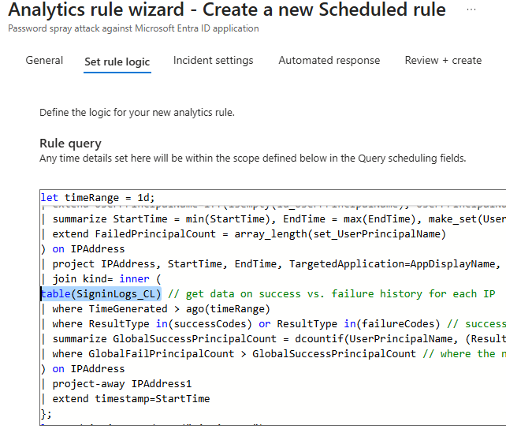

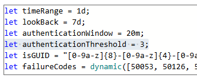

**Answer: 3**

 

### 3.3) The analytics rule you created to detect the attack patterns by analyzing failed authentication attempts over specific time periods. Review the KQL query in your analytics rule and locate the parameter that defines the time window for grouping authentication attempts. What is the value (in minutes) set for the authenticationWindow parameter?

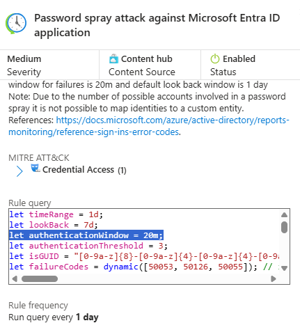

**Answer: 20**

 

### 3.4) After creating and enabling your custom analytics rule using SignInLogs only, it successfully triggers and generates an incident for the attack that happened. Navigate to Incidents in Microsoft Sentinel and open the newly created incident. Review the entities section, which shows all IP addresses involved in this attack. List all attacker IP addresses identified in the incident.

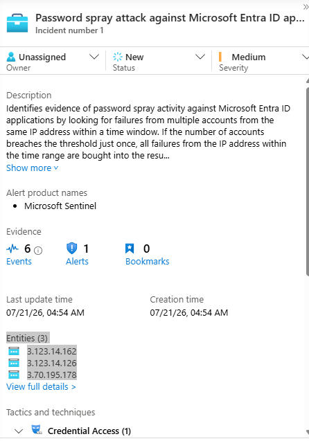

**Answer: 3.123.14.162, 3.123.14.126, 3.70.195.178**

 

### 3.5) What is the minimum number of failed attempts from a single IP before Smart Lockout triggers for an unfamiliar location (based on default settings)?

Quick lookup

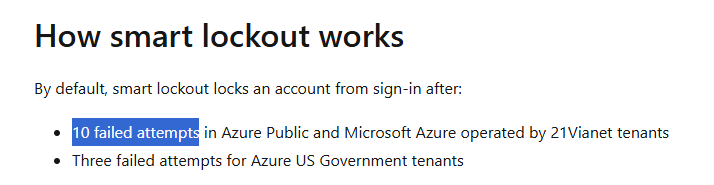

**Answer: 10**

---

 

## 4. Investigation and Forensics

### 4.1) Investigation revealed that despite the widespread attack, only one account was successfully compromised. What is the user principal name of the account that was successfully breached?

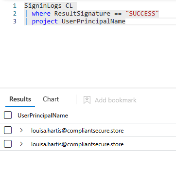

**Answer: louisa.hartis@compliantsecure.store**

---

 

## 5. Mitigation and Controls

### 5.1) What Conditional Access policy would have prevented 99% of this password spray attack according to Microsoft's research?

Quick lookup

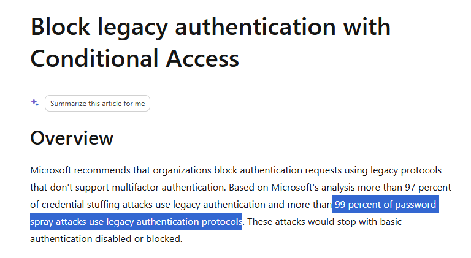

**Answer: Block legacy authentication**

 

### 5.2) When implementing Azure AD Password Protection to prevent compromised accounts, what is the maximum number of password entries you can add to the custom banned password list?

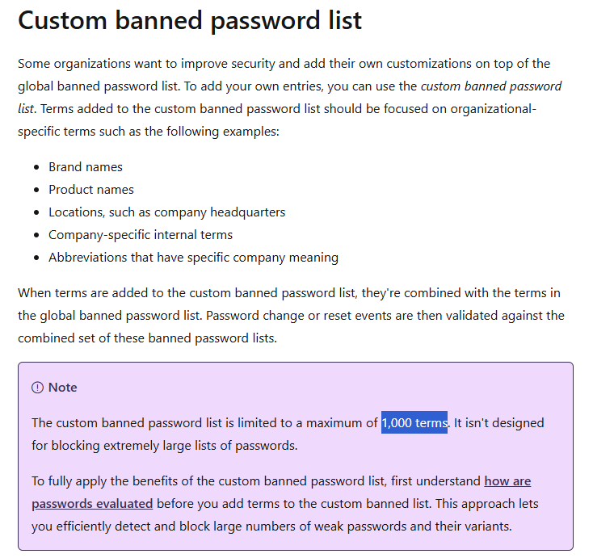

**Answer: 1000**

 

### 5.3) For federated environments, what Windows Server 2019 feature provides similar protection to Azure AD Smart Lockout?

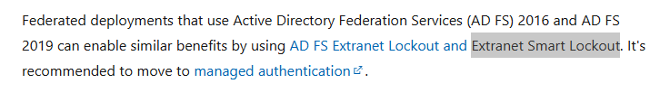

**Answer: Extranet Smart Lockout**

 

### 5.4) Analytics rules in Microsoft Sentinel can trigger automated responses through playbooks when incidents are created. This enables immediate remediation actions without manual intervention. In your custom analytics rule configuration, navigate to the "Automated response" tab where you can attach playbooks. If you were to create a playbook that revokes all active sessions for compromised users detected by this rule, what Microsoft Graph API method would the playbook use to invalidate all user sessions?

**Answer:**

 

### 5.5) According to NIST guidelines referenced in the mitigation section, what is the recommended minimum password length for modern password policies?

**Answer:**

---

**Completed:**

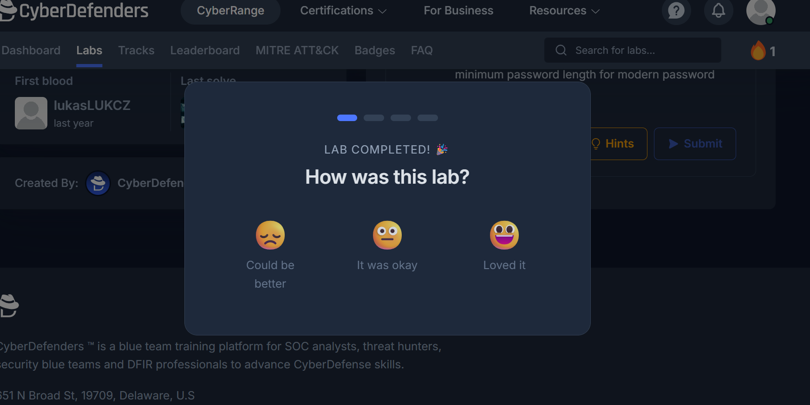
