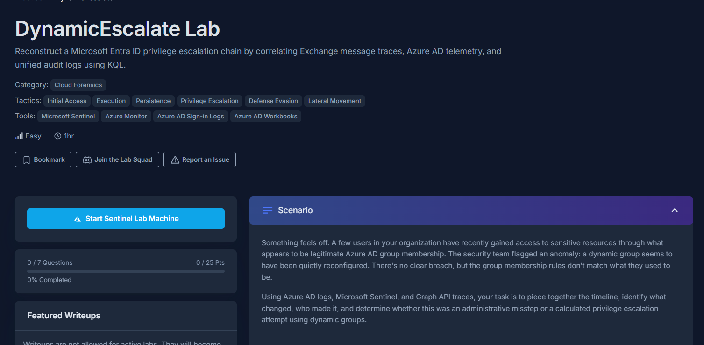
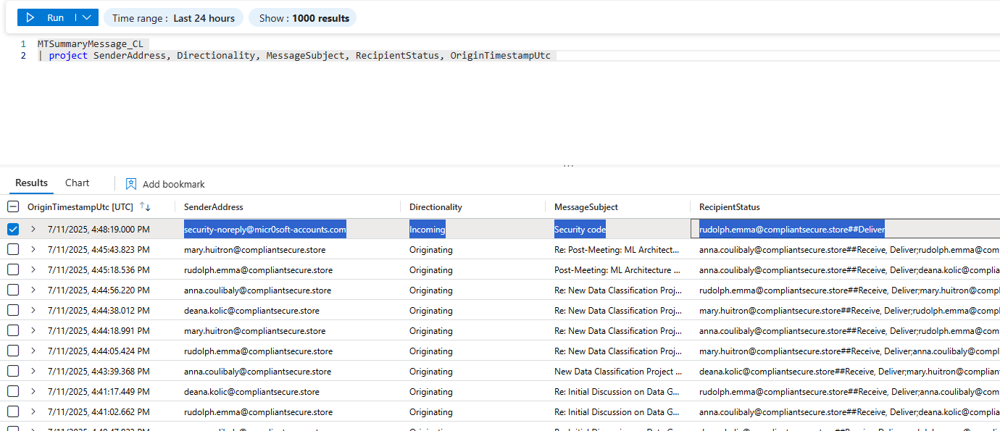
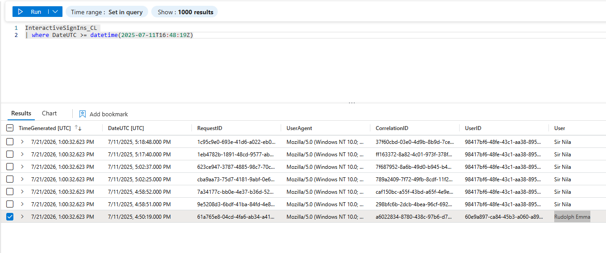
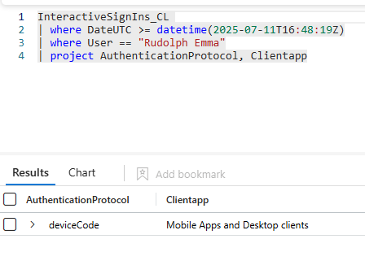
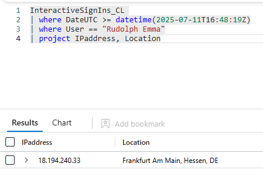
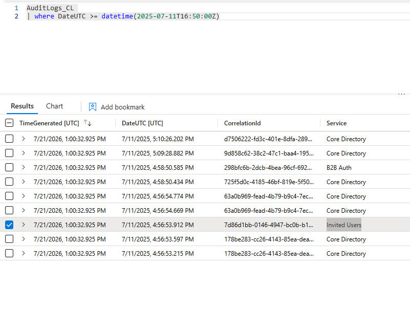
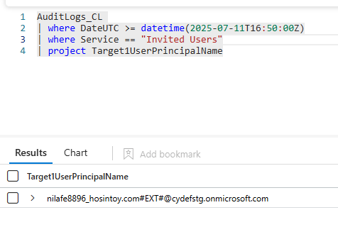
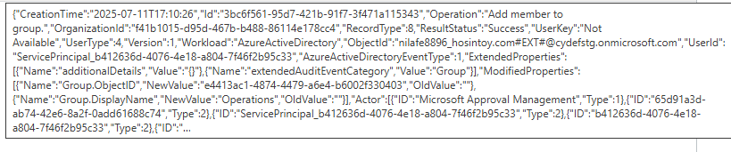
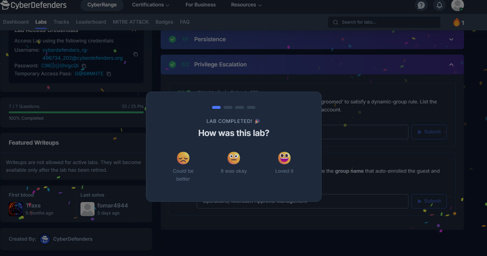

# Overview

###  A few users in your organization have recently gained access to sensitive resources through what appears to be legitimate Azure AD group membership. The security team flagged an anomaly: a dynamic group seems to have been quietly reconfigured. There's no clear breach, but the group membership rules don’t match what they used to be.

 

### Methodology:

**Using Azure AD logs, Microsoft Sentinel, and Graph API traces, we are tasked with piecing together the timeline, identifying what changed, who made it, and determining whether this was an administrative misstep or a calculated privilege escalation attempt using dynamic groups.**

---

 

### Attack Chain:

---

 

## Indicators of Compromise:

---

 

## MITRE ATT&CK Mapping:

---

 

# Investigation:

## 1. Initial Access

### 1.1) While reviewing Microsoft Sentinel logs during an investigation into suspicious changes, you pivot to Exchange message-trace for the lure. Which email Subject line confirmed the phishing message that kicked off the attack?

**Answer: Security code**

 

### 1.2) Correlating mail delivery with Azure AD logs, you isolate the first attacker log-on. List the authentication protocol and client application that reveal abuse of the device-code flow.

**Answer: deviceCode, Mobile Apps and Desktop clients**

 

### 1.3) Geo-enrichment shows the sign-in came from an unfamiliar location. What public IP address presented the stolen token?

**Answer: 18.194.240.33**

 

### 1.4) Precise timing is critical for scoping the blast radius. What UTC timestamp marks the attacker’s first successful device-code sign-in?

**Answer: 2025-07-11 16:50**

---

 

## 2. Persistence

### 2.1) Minutes later, logs show a new external identity being invited. What guest UPN did the attacker create for persistence?

**Answer: nilafe8896_hosintoy.com#EXT#@cydefstg.onmicrosoft.com**

---

 

## 3. Privilege Escalation

### 3.1) Still tracking the guest’s lifecycle, you notice it being ‘groomed’ to satisfy a dynamic-group rule. List the two attributes and their new values set on the guest account.

Searched every data point from all 4 sources (including the AuditData column) and couldn't find the answer. Also looked in other azure apps but couldn't find anything. I looked it up and others had this problem too so I went ahead and looked up the answer: country=US, department=Operations. This makes sense as the attributes are being added for the guest user to become a part of the dynamic group.

**Answer: country=US, department=Operations**

 

### 3.2) Seconds later, the dynamic-group engine fires. Provide the group name that auto-enrolled the guest and the application identity recorded as the actor.

**Answer: Operations, Microsoft Approval Management**

---

**Completed:**

