# Overview

###  On November 14, 2025, security monitoring detected suspicious authentication activity in the Azure tenant, with anomalous sign-in patterns from multiple geographic locations. Shortly after, automated alerts flagged unauthorized administrative actions and configuration changes within the environment.

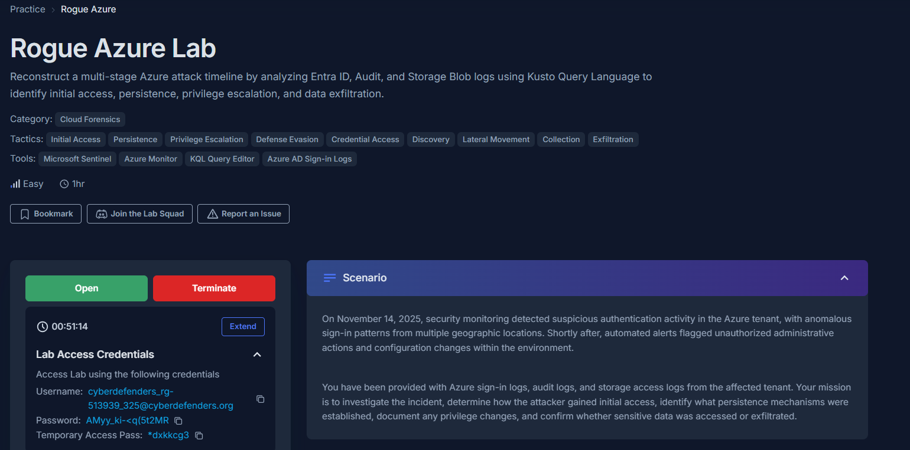

 

### Methodology:

**Provided with Azure sign-in logs, audit logs, and storage access logs from the affected tenant, my mission is to investigate the incident, determine how the attacker gained initial access, identify what persistence mechanisms were established, document any privilege changes, and confirm whether sensitive data was accessed or exfiltrated.**

---

 

### Attack Chain:

---

 

## Indicators of Compromise:

---

 

## MITRE ATT&CK Mapping:

---

 

# Investigation:

## 1. Initial Access

### 1.1) The investigation begins by analyzing a password spray attack that targeted several users in the primary tenant. What IP address did the attacker originate the password spray attack from?

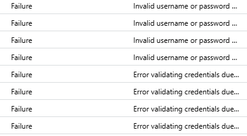

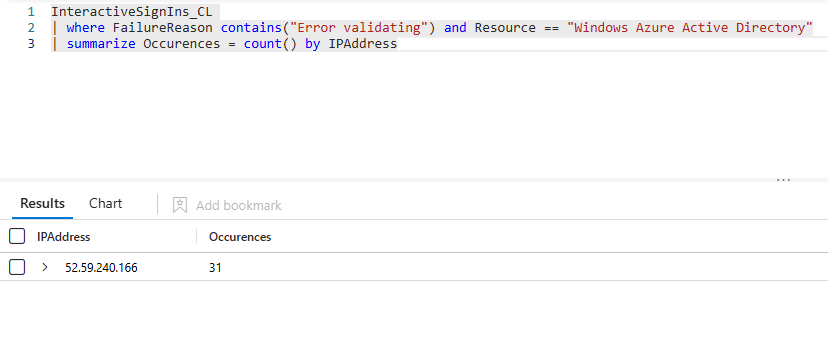

**Answer: 52.59.240.166**

 

### 1.2) After numerous failed attempts, the attacker successfully gained access to an account. What is the username of the first account that was compromised?

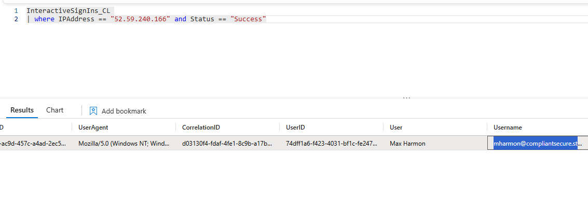

**Answer: mharmon@compliantsecure.store**

---

 

## 2. Command and Control

### 2.1) Following the initial compromise, the attacker began using a new infrastructure for post-exploitation activities. What is the second IP address used by the attacker?

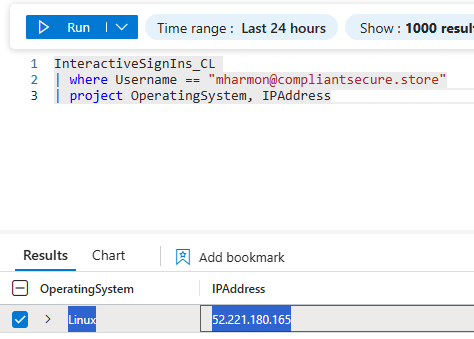

**Answer: 52.221.180.165**

 

### 2.2) From which country did the successful sign-in originate when the attacker pivoted to their secondary infrastructure for post-exploitation activities?

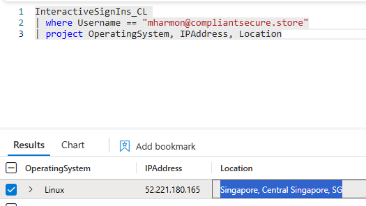

**Answer:**

---

 

## 3. Persistence

### 3.1) To establish persistence, the attacker registered malicious applications. What is the name of the first application they created?

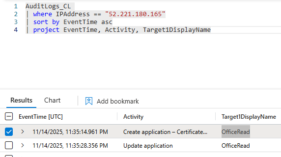

**Answer:**

 

### 3.2) The attacker created a second application to ensure persistent access, this one intended to access directory information. What is the name of this second application?

See 3.1

**Answer: VaultApp**

---

 

## 4. Privilege Escalation

### 4.1) To create a redundant backdoor, the attacker used the compromised administrator account to elevate the privileges of another user. What is the User Principal Name of the account that had its privileges escalated?

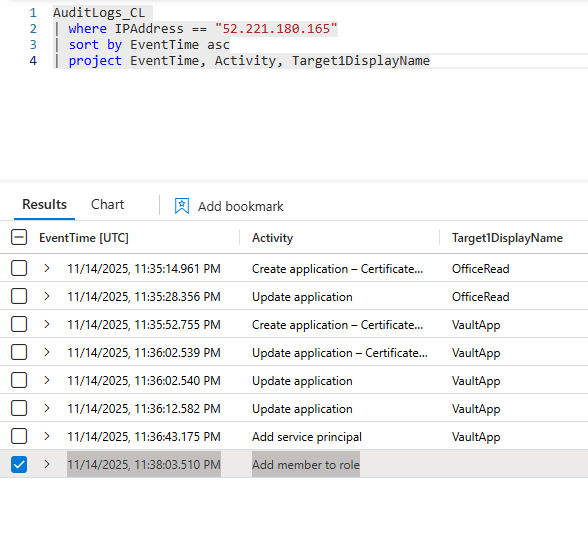

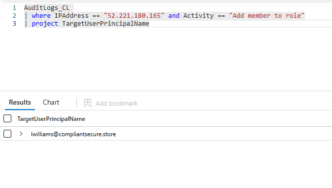

**Answer: lwilliams@compliantsecure.store**

 

### 4.2) What highly privileged role was assigned to the second user account to grant it administrative control over the tenant?

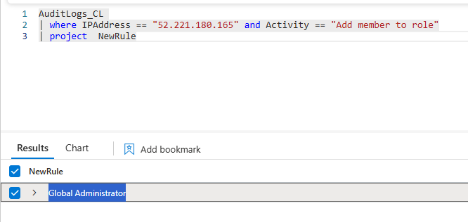

**Answer: Global Administrator**

---

 

## 5. Collection & Exfiltration

### 5.1) The attacker's final objective was data exfiltration. They targeted a specific storage resource to access sensitive files. What is the name of the storage account they accessed?

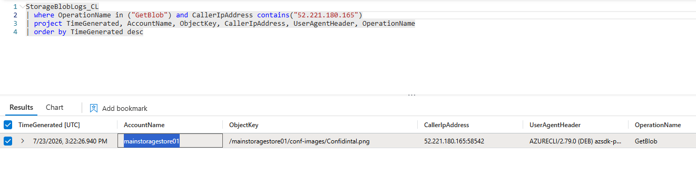

**Answer: mainstoragestore01**

 

### 5.2) The attacker successfully downloaded a sensitive file from the storage account. What is the name of the exfiltrated file?

See 5.1

**Answer: Confidintal.png**

---

 

**Completed:**

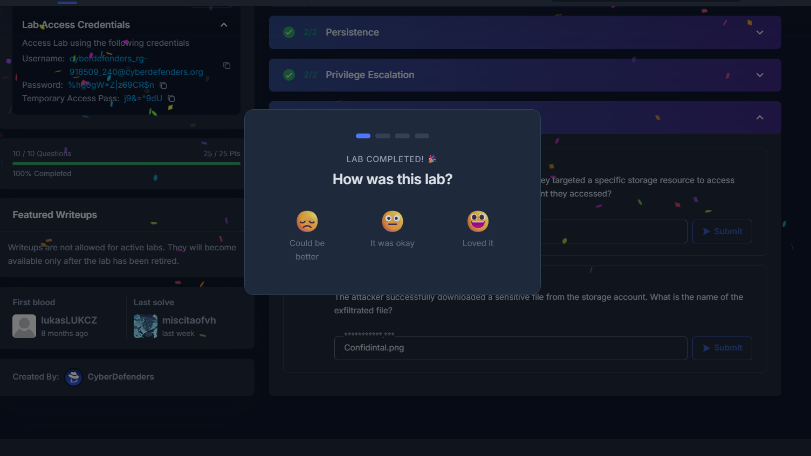

